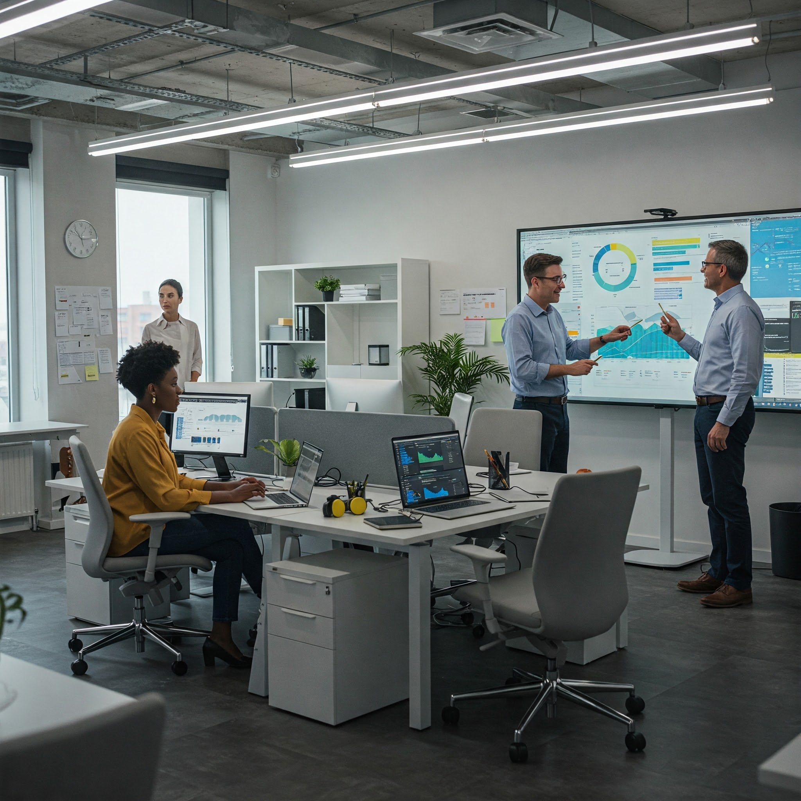

**ONE**: The value to an organisation of its digital workplace will increasingly hinge on two related capabilities:

- The ability to spot, learn from and recreate a good user experience
- The ability to spot, learn from and do something about a poor user experience

**TWO**: The digital workplace team needs:

- The tools to do the spotting
- The attitude and the processes to do the learning
- The culture and the means to embed the good and to fix the bad

**THREE**: The digital workplace team will need to:

- Define data points that indicate the user experience across multiple parts of the digital workplace
- Use those data points across short and longer term timeframes in analyses that provide immediate or trending insight
- Demand that design elements (technical or process) that deliver a good user experience are easily learned from and re-used
- Have the means to get poor user experiences addressed, learned from and never repeated

**FOUR**: The digital workplace team (and all their customers and stakeholders) will want:

- User Experience to be as high on the agenda for technical designs for user-facing solutions as topics like security
- User Experience to be at the top of the agenda when service and operational processes are being designed
- Design reviews and governance (whether for technology or processes) set standards for and police user experience design
- User Experience to be an intrinsic part of the organisation’s digital workplace culture and ways of working

---
[Contents](Contents.md)

---

# CAUTION

**This site is a work-in-progress**

